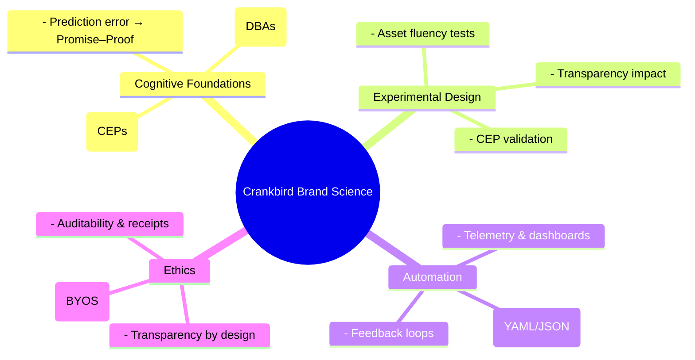
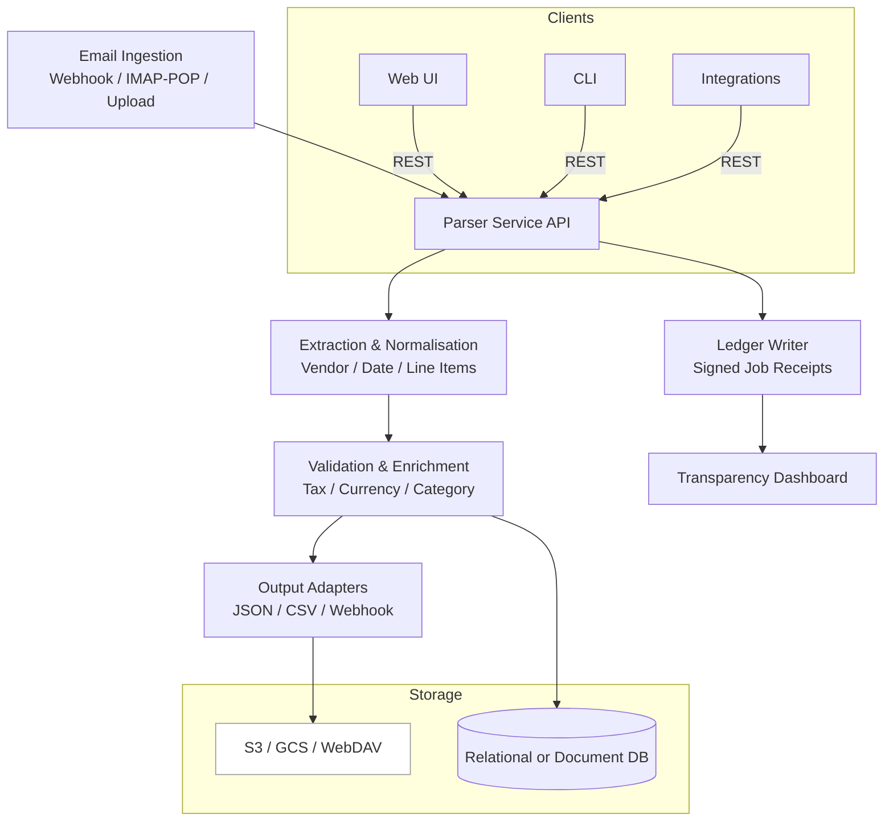
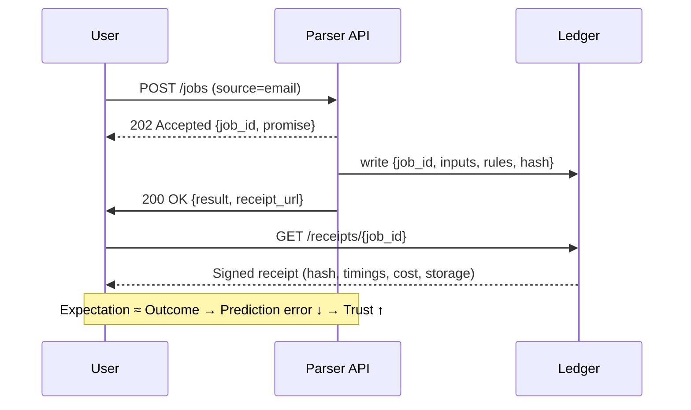
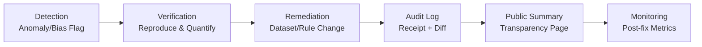

# Crankbird Brand Science Playbook



## A Scientific Framework for Automated Brand Development

---

## Table of Contents

1. [Abstract and Theoretical Foundations](#chapter-1--abstract-and-theoretical-foundations)
2. [Model Architecture](#chapter-2--model-architecture)
3. [Methodology and Experimental Design](#chapter-3--methodology-and-experimental-design)
4. [Application to Crankbird Automation](#chapter-4--application-to-crankbird-automation)
5. [Discussion, Ethical Implications & Conclusion](#chapter-5--discussion-ethical-implications--conclusion)
6. [Annotated Literature Review and References](#chapter-6--annotated-literature-review-and-references)

---

# Chapter 1 – Abstract and Theoretical Foundations

## Abstract
This paper develops a theoretical and empirical foundation for an automatable framework of brand development grounded in cognitive psychology, behavioural economics, and marketing science. It argues that brand strength arises from three measurable dynamics: (a) associative memory structures that determine mental availability, (b) perceptual fluency and distinctiveness that reduce cognitive effort and increase trust, and (c) alignment between promise and proof that minimises prediction error and builds belief stability through verified feedback loops. Integrating these mechanisms provides a scientific basis for testing and automating brand development. The framework is applied to Crankbird, an emerging ethical-technology venture whose design ethos emphasises autonomy, transparency, and legibility.

---

## 1.1 Introduction
Modern brand practice often relies on intuition, creative fashion, or simplified narrative frameworks such as StoryBrand. These systems lack empirical grounding in cognitive or behavioural theory and therefore resist automation. In contrast, research from cognitive psychology (Tulving, 1972; Anderson, 1983), marketing science (Sharp, 2010; Romaniuk & Sharp, 2016), and behavioural economics (Thaler & Sunstein, 2008) offers measurable, falsifiable mechanisms for how brands form and persist in memory.

This paper synthesises those findings to outline a testable model that can be encoded in software and evaluated experimentally. It treats branding not as surface-level communication but as cognitive engineering—the deliberate shaping of associative networks, perceptual cues, and predictive feedback loops that govern user trust.

---

## 1.2 Theoretical Foundations

### Memory Networks and Mental Availability
Tulving (1972) distinguished episodic from semantic memory, establishing that recall is cue-dependent. Anderson's (1983) spreading activation model demonstrated that concepts connected within associative networks become more accessible when activated by relevant cues. Ehrenberg-Bass research applies this to branding: each purchase or consumption context functions as a Category Entry Point (CEP)—a retrieval cue that triggers brand recall (Romaniuk & Sharp, 2016).

Empirically, a brand's share of CEP associations predicts both market share and advertising efficiency (Sharp, 2010; Romaniuk & Sharp, 2016). The design implication is clear: brand building should focus on linking distinctive assets and narratives to specific contextual triggers rather than to abstract positioning statements.

---

### Distinctive Brand Assets and Perceptual Fluency
Reber, Schwarz, and Winkielman (2004) showed that stimuli processed fluently—quickly, with low perceptual effort—are judged as truer and more aesthetically pleasing. In branding, distinctive assets such as colour, shape, sound, and phrasing exploit this principle by creating recognition without decoding (Romaniuk, 2018).

Processing-fluency research (Graf, Mayer, & Landwehr, 2018) distinguishes hedonic fluency (pleasure of ease) from cognitive fluency (perceived credibility). Both reinforce trust when users encounter consistent design patterns. Thus, coherent design systems and typography are not merely stylistic—they are epistemic instruments that signal reliability.

---

### Schema and Narrative Cognition
Bartlett (1932) demonstrated that memory reconstructs experience through culturally shared schemas. Schank and Abelson (1977) formalised this as scripts: canonical sequences such as "problem → action → outcome." When brand messages follow these patterns, comprehension and recall improve because they align with pre-existing narrative structures.

Experimental evidence shows that schema-consistent stories generate stronger memory traces than lists of features (Graesser, Millis, & Zwaan, 1997). Therefore, short, context-specific micronarratives—each tied to a CEP—can serve as the atomic units of automated content generation.

---

### Prediction Error and Belief Formation
Friston's (2010) free-energy principle models the brain as a prediction-error minimiser. When reality matches expectation, neural energy decreases and confidence increases. This implies that credible brands should close the loop between promise and observable proof. Each fulfilled expectation—transparent pricing, visible data receipts—reduces cognitive dissonance and strengthens belief stability (Hohwy, 2013).

---

### Behavioural Architecture and Autonomy
Thaler and Sunstein (2008) demonstrated that subtle design of choice architecture (defaults, feedback, friction) shapes decisions without coercion. Deci and Ryan's (2000) Self-Determination Theory adds that autonomy, competence, and relatedness are intrinsic motivators. For ethical technology, interfaces that reveal control—such as Bring Your Own Storage (BYOS) options or reversible actions—support these needs and therefore increase engagement quality even if not raw usage frequency.

Fogg's (2009) behavioural model (B = M×A×P) provides a quantitative basis: success requires a balance of motivation, ability, and prompt. Designing interventions that raise perceived ability (clarity, reversibility) while maintaining user autonomy aligns ethical design with effectiveness.

---

# Chapter 2 – Model Architecture  

The proposed framework integrates research on associative memory, perceptual fluency, and prediction error into three operational modules: Category Entry Points (CEPs), Distinctive Brand Assets (DBAs), and Promise–Proof Loops. Each module is independently measurable and collectively forms the basis for automation and experimental testing within the Crankbird system.

---

## 2.1  Category Entry Points (CEPs)  

**Definition:**  
A Category Entry Point (CEP) is a contextual cue that triggers a brand in memory at the moment of need (Romaniuk, 2018).  
Examples: "end-of-month expense reconciliation," "uploading receipts to Xero," or "auditor requests source data."

**Cognitive basis:**  
Retrieval follows spreading-activation dynamics (Anderson, 1983); strengthening links between the brand node and these situational cues increases recall probability.

**Operationalisation:**  
1. Collect natural-language cues from user interviews, support tickets, and search data.  
2. Cluster cues using semantic-embedding similarity.  
3. Quantify association strength = brand-recall rate / cue frequency.  
4. Track longitudinal changes via prompted-recall surveys.

**Experimental hypothesis:**  
> H₁: The number of distinct, salient CEPs associated with a brand predicts top-of-mind awareness and choice share (Sharp, 2010).

---

## 2.2  Distinctive Brand Assets (DBAs)  

**Definition:**  
Non-verbal signifiers—colour, shape, sound, motion, or phrase—that allow recognition without the logo (Romaniuk, 2018).  

**Cognitive basis:**  
Perceptual fluency (Reber, Schwarz, & Winkielman, 2004) → ease of recognition → affective trust.  
Consistent assets produce processing efficiency across channels (Graf, Mayer, & Landwehr, 2018).

**Operationalisation:**  
1. Audit existing assets; code for modality, distinctiveness, and usage consistency.  
2. Test fame (correct attribution %) and uniqueness (confusion %).  
3. Compute fluency-trust correlation: reaction-time vs. perceived credibility.  
4. Optimise through A/B tests on degraded or monochrome stimuli.

**Experimental hypothesis:**  
> H₂: Higher perceptual fluency and distinctiveness of DBAs increase both recognition speed and perceived brand integrity.

---

## 2.3  Promise–Proof Loops  

**Definition:**  
Coupled stimuli where an explicit claim ("promise") is immediately followed by verifiable evidence ("proof").  
Examples: transparent pricing rules, signed job receipts, BYOS toggles.

**Cognitive basis:**  
Prediction-error minimisation (Friston, 2010) and expectancy-confirmation (Hohwy, 2013). Each closed loop strengthens belief stability and reduces cognitive load.

**Operationalisation:**  
1. Catalogue all user-facing claims.  
2. Map each to a visible, verifiable outcome.  
3. Instrument system telemetry to detect loop completion.  
4. Correlate completion rate with trust, NPS, and retention.

**Experimental hypothesis:**  
> H₃: Interfaces with explicit Promise–Proof Loops generate higher self-reported trust and lower support-ticket volume than equivalent opaque interfaces.

---

## 2.4  Integrated Brand System Model  

| Cognitive Mechanism        | Operational Construct      | Metric                            | Expected Effect            |
|---------------------------|---------------------------|-----------------------------------|---------------------------|
| Spreading activation      | Category Entry Points      | # of CEPs linked to brand         | Mental availability       |
| Perceptual fluency        | Distinctive Brand Assets   | Recognition RT; Fame/Uniqueness   | Processing ease → trust   |
| Prediction-error minimisation | Promise–Proof Loop     | Completion rate; trust delta      | Belief stability          |
| Autonomy support          | Transparent architecture  | Perceived control survey          | Intrinsic motivation      |

These constructs form a closed system in which truth manifests as legibility—the governing principle of Crankbird's brand ethos.

---

## 2.5  Automatability and Data Schema  

Each construct can be represented as structured data, enabling automation:  

```yaml
brand_model:
  cep:
    id: "expense_audit"
    cue_text: "auditor requests receipts"
    association_strength: 0.42
  dba:
    color: "sunburst_yellow"
    fame: 0.68
    uniqueness: 0.09
  promise_proof:
    claim: "Data ownership stays with you"
    proof: "BYOS_toggle=true"
    completion_rate: 0.94
```

This schema allows machine agents to read, update, and test brand components autonomously while maintaining auditability—fulfilling the "back-of-the-cabinet" ethic of visible integrity.

---

# Chapter 3 – Methodology and Experimental Design  

The following methodology outlines how to validate the Crankbird Brand Model through controlled, replicable experiments. Each construct—CEPs, DBAs, and Promise–Proof Loops—has measurable dependent variables that can be tested using mixed quantitative and qualitative approaches.  

---

## 3.1  Research Design Philosophy  

The framework follows the scientific principles articulated by Platt (1964) in his "strong inference" approach: generate multiple hypotheses, design critical tests, and iterate. Brand-building activities thus become a series of falsifiable experiments rather than subjective creative exercises.  

Statistically, experiments employ within-subject or between-subject designs with random assignment, analysed via mixed-effects models to account for repeated exposure and individual variance (Baayen et al., 2008).  

Dependent variables include:  
- **Recognition speed (ms)** — reaction-time measures from implicit association tests.  
- **Brand recall probability** — open-response brand recall following CEP prompts.  
- **Perceived trust (Likert 1–7)** — measured post-exposure.  
- **Behavioral engagement metrics** — conversion, retention, opt-out rates.  

---

## 3.2  CEP Validation Studies  

### Objective  
Test whether increasing the number and salience of Category Entry Points improves mental availability and purchase intent.  

### Method  
1. **Sample:** n ≥ 300 participants per experimental cell, recruited via online panels.  
2. **Design:** between-subjects; each participant exposed to one of two ad sets—control (generic messaging) vs. experimental (CEP-tied narratives).  
3. **Measures:**  
- Unaided recall: "Which brands come to mind when you think about [cue]?"  
- Recognition: binary yes/no brand identification.  
- Intent: self-reported likelihood to consider the brand.  
1. **Analysis:** logistic regression predicting recall and intent from number of CEP exposures.  

### Expected Outcome  
Significant main effect of CEP exposure on recall (β > 0, p < .05).  

---

## 3.3  DBA Distinctiveness and Fluency Tests  

### Objective  
Quantify perceptual fluency and the fame/uniqueness of Distinctive Brand Assets.  

### Method  
1. **Asset recall test** — present assets (e.g., colour patch, shape, tagline) without logos; measure correct attribution rate (Romaniuk, 2018).  
2. **Recognition latency test** — measure reaction time to identify brand under visual noise conditions (Reber et al., 2004).  
3. **Processing fluency survey** — self-rated ease and likability (Graf et al., 2018).  
4. **Data analysis:** ANOVA comparing mean latency and likability across asset variants.  

### Expected Outcome  
High fluency (shorter RT) and distinctiveness (low confusion) predict stronger trust and preference ratings.  

---

## 3.4  Promise–Proof Loop Experiments  

### Objective  
Determine whether transparent feedback mechanisms increase trust and reduce uncertainty.  

### Method  
1. **Design:** within-subjects; same task completed under two UI conditions—opaque vs. transparent.  
2. **Manipulation:** display or hide visible receipts, BYOS toggles, and open pricing rules.  
3. **Measures:**  
- Self-reported trust (Mayer, Davis, & Schoorman, 1995).  
- Perceived integrity and benevolence subscales.  
- Support request frequency (objective behavioral data).  
1. **Analysis:** paired t-tests and mediation models linking transparency → perceived integrity → trust.  

### Expected Outcome  
Statistically significant increase in trust and reduced support tickets in the transparent condition.  

---

## 3.5  Narrative Schema and Comprehension  

### Objective  
Test whether schema-consistent "micronarratives" yield better comprehension and retention than factual lists.  

### Method  
1. Participants read or view one of two message formats: narrative (problem → action → outcome) or factual (feature list).  
2. After a 24-hour delay, assess recall and comprehension (Graesser et al., 1997).  
3. Secondary measure: time-to-first-meaning via eye-tracking.  

### Expected Outcome  
Narrative structure leads to higher delayed recall and lower time-to-first-meaning, confirming schema congruence effects (Bartlett, 1932; Schank & Abelson, 1977).  

---

## 3.6  Autonomy and Behavioral Architecture  

### Objective  
Evaluate how user autonomy influences engagement and satisfaction.  

### Method  
1. Compare task performance between fixed-path and self-directed onboarding flows.  
2. Manipulate reversibility (undo options) and data control visibility.  
3. Measure completion, dropout, and perceived autonomy using the Self-Determination Index (Deci & Ryan, 2000).  
4. Analyze via two-way ANOVA (flow × reversibility).  

### Expected Outcome  
Higher perceived autonomy and task satisfaction in reversible, self-directed flows, even with slightly lower efficiency—supporting ethical design alignment.  

---

## 3.7  Longitudinal Brand Lift  

### Objective  
Integrate short-term activation with long-term brand equity, per Binet and Field (2013).  

### Method  
1. Run quarterly brand-lift surveys: top-of-mind awareness, association with brand values (transparency, autonomy).  
2. Track asset fame, CEP coverage, and trust metrics over time.  
3. Model longitudinal effects using linear mixed models across campaigns.  

### Expected Outcome  
Consistent increases in asset fame and CEP coverage predict parallel increases in long-term brand trust and preference.  

---

## 3.8  Data Management and Ethics  

All experiments follow open-science standards: pre-registration, anonymised data, and reproducible analysis scripts (Wilkinson et al., 2016). Data are stored in open formats (CSV, JSON, YAML) to allow external audit and alignment with Crankbird's transparency ethos.  

---

# Chapter 4 – Application to Crankbird Automation  

## Case Study: Email Parser MVP (API-First, Ethical by Design)

### Context
Crankbird’s first SaaS module ingests email receipts and outputs structured transactions. The MVP is designed **API-first** (UI and CLI are thin clients over the same REST surface), with **BYOS** storage options and **verifiable receipts** for every operation.

### Hypotheses
H1 — **Promise–Proof:** Showing signed receipts and data lineage will increase perceived trust vs. an opaque UI.  
H2 — **Fluency:** A minimal, consistent asset set (icon + color + type scale) reduces time-to-first-meaning and support tickets.  
H3 — **CEPs:** Tying messages to concrete buying moments (e.g., *“Reconcile card charges”*, *“Prepare BAS report”*) increases recall and consideration.

### API-First Development Principle
1) Define and publish REST (OpenAPI) and events.  
2) Ship headless service + receipts.  
3) Build UI/CLI over the same API.  
4) If the UI needs more, **augment the API**, not the client.

### Measures
- **Trust delta** (Mayer et al., 1995) between opaque vs. transparent flows.  
- **Support load** (# tickets per 1000 jobs).  
- **Fluency index** (z-scored RT + likability).  
- **CEP coverage** (% prompts that elicit Crankbird unaided).

### Procedure (v1)
1) Randomly assign participants to **Transparent** vs **Opaque** conditions.  
2) Each uploads 5 receipts via UI (which calls the same REST).  
3) Transparent group sees: storage choice, pricing rule, job ledger link.  
4) Collect trust ratings, latency, and support interactions.  
5) Analyse paired outcomes; log telemetry receipts.

### Expected Outcome
Transparent + API-first design yields higher trust, fewer tickets, equal or better task completion.

### Notes for v2
- Add public OpenAPI doc, CLI example, and K8s deployment template.  
- Extend BYOS to S3/GCS/WebDAV; keep local dev storage (MinIO) parity.  
- Publish anonymised telemetry + bias/accessibility checks.





This section translates the theoretical model and empirical methods into the Crankbird platform's operational design. Crankbird treats its brand as a living data system that can be measured, iterated, and expressed through every surface—from UI components to pricing logic.

---

## 4.1  System Architecture Overview  

Crankbird's brand engine is structured as three cooperating subsystems:

| Subsystem | Function | Empirical Basis |
|------------|-----------|----------------|
| **Semantic Layer** | Encodes Category Entry Points (CEPs) and narrative schemas as structured data for retrieval and generation. | Associative network theory (Anderson, 1983). |
| **Perceptual Layer** | Manages Distinctive Brand Assets (DBAs) as cross-platform design tokens. | Processing-fluency research (Reber et al., 2004). |
| **Verification Layer** | Implements Promise–Proof Loops—telemetry, receipts, pricing logic—to close the cognitive prediction loop. | Prediction-error minimisation (Friston, 2010). |

The integration of these layers allows Crankbird to align *form* and *truth*: each software artifact behaves as evidence of the brand's ethical stance.

---

## 4.2  Semantic Layer – Automating CEPs and Micronarratives  

1. **Data ingestion.** Natural-language processing extracts potential CEPs from customer interactions, search logs, and support emails.  
2. **Clustering.** Vector embeddings group semantically related cues; each cluster becomes a candidate CEP.  
3. **Narrative synthesis.** For each CEP, a GPT-based agent composes a short story template: *Situation → Tension → Enabling Act → Outcome → Evidence* (Schank & Abelson, 1977).  
4. **Human review.** Editors approve narratives for tone and factual accuracy.  
5. **Feedback loop.** Engagement and comprehension metrics update association strengths in the CEP table.

*Result:* The system continually learns which contexts and stories most effectively cue brand recall.

---

## 4.3  Perceptual Layer – Managing Distinctive Brand Assets  

Crankbird's Figma design kit exports tokens (color, type, spacing, motion) as JSON for programmatic use in web, app, and presentation templates. Each token carries metadata for *fame*, *uniqueness*, and *usage frequency*.

Example schema:

```yaml
token:
  id: "color.sunburst"
  value: "#FFC93C"
  fame_score: 0.72
  uniqueness_score: 0.08
  channel_usage: ["web", "deck", "ads"]
```

Automated scripts periodically test asset fame and uniqueness via quick recognition surveys (Romaniuk, 2018). Results feed back into the token database, allowing data-driven refinement of the visual language.

---

## 4.4  Verification Layer – Implementing Promise–Proof Loops  

Each Crankbird SaaS module emits **signed job receipts** that document:  
- action performed,  
- resources used,  
- data-storage location, and  
- hash-based verification of success.

Example:

```json
{
  "job_id": "rxp-2025-04-001",
  "user_id": "U87654",
  "action": "parse_email_receipt",
  "output_location": "user-drive/receipts/2025-04",
  "signature": "sha256-…",
  "verified": true
}
```

These receipts serve simultaneously as operational logs and as perceptual proofs of transparency—closing the loop predicted by Friston's (2010) model. Users can export, audit, or share them, reinforcing ownership and trust.

---

## 4.5  Experimental Telemetry  

All user interactions are logged with anonymised identifiers and tagged to their originating constructs (CEP, DBA, Promise–Proof). The telemetry schema mirrors the experimental metrics defined earlier, allowing real-time hypothesis testing.

| Construct | Logged Variable | Metric |
|------------|-----------------|--------|
| CEP | cue_trigger_id | recall probability |
| DBA | asset_id | recognition latency (ms) |
| Promise–Proof | proof_viewed | trust delta survey score |

Analysis dashboards aggregate these data to visualise brand-health trends over time—essentially a *brand observability* layer.

---

## 4.6  Automation Workflow  

1. **Input:** New CEPs or assets added by design or marketing teams.  
2. **Processing:** Agents evaluate new inputs against existing associations and fluency scores.  
3. **Output:** Updated brand tokens, narratives, and UI components pushed to all channels.  
4. **Feedback:** Experimental results feed back into the model for continuous learning.  

This closed loop ensures the brand evolves empirically rather than subjectively.

---

## 4.7  Ethical Safeguards  

- **Transparency:** All algorithmic decisions logged and auditable.  
- **User sovereignty:** BYOS (Bring Your Own Storage) enforced by design.  
- **Explainability:** Each automated decision accompanied by a human-readable rationale.  
- **Open formats:** Data stored as CSV, JSON, YAML; no proprietary lock-in.

These safeguards express the same *"back-of-the-cabinet"* integrity that drives Crankbird's engineering and aesthetic philosophy (Isaacson, 2011).

---

# Chapter 5 – Discussion, Ethical Implications & Conclusion  



This chapter synthesises the findings of the Crankbird Brand Science Playbook, discusses the ethical implications of brand automation, and outlines opportunities for future research and application.  

---

## 5.1  Integrating Science and Design  

The Crankbird model demonstrates that branding can be treated as a scientific discipline without losing its creative dimension. By grounding brand formation in measurable cognitive and behavioural mechanisms—memory networks (Tulving, 1972), perceptual fluency (Reber et al., 2004), and prediction-error minimisation (Friston, 2010)—we transform intuition-driven marketing into evidence-based design.  

Automation does not remove creativity; it reallocates it. Designers can focus on creating new metaphors and assets, while machine agents optimise their empirical performance. This complementarity mirrors other domains—such as engineering and medicine—where art and empiricism coexist productively.  

---

## 5.2  Ethical Foundations  

### Transparency and Autonomy  
At its philosophical core, Crankbird's framework aligns with the ethics of autonomy (Deci & Ryan, 2000) and transparency (Lewicki et al., 1998). Each design choice—visible receipts, BYOS, open data schemas—translates moral commitments into tangible experiences. Users gain control over their data and insight into system logic, which converts abstract values into behavioural trust.  

### Against Exploitation  
Traditional marketing often operates on asymmetry: firms know more about users than users know about themselves. Crankbird's approach seeks symmetry—leveraging telemetry for performance and reliability, not behavioural manipulation. By design, it rejects the extractive logic of surveillance capitalism (Zuboff, 2019).  

### Auditable Systems  
Every layer of the brand automation stack is built for auditability. The principle of *"truth manifests as legibility"* ensures that even internal processes—machine learning weights, rule-based transformations, telemetry pipelines—remain inspectable. This transparency not only supports compliance and accountability but also functions as a differentiating brand promise in itself.  

---

## 5.3  Practical Implications for Organisations  

1. **Repeatable Brand Experiments** — Brand teams can move from one-off campaigns to continuous learning systems.  
2. **Unified Design-Language Pipelines** — Figma tokens become measurable data objects, linking brand expression with empirical performance.  
3. **Ethical AI Governance** — By encoding rules of consent, explainability, and reversibility, Crankbird's system provides a model for trustworthy automation.  
4. **Adaptive Storytelling** — Micronarratives enable context-specific communication at scale without violating coherence or brand tone.  
5. **Operational Efficiency** — Reduces waste in marketing spend by identifying high-impact CEPs and removing redundant assets.  

---

## 5.4  Limitations and Risks  

1. **Data Bias** — If input data (e.g., user feedback or telemetry) reflects skewed demographics, resulting recommendations may reproduce bias. Mitigation requires diversity audits and fairness checks.  
2. **Interpretive Overreach** — Quantitative proxies (e.g., recognition latency) can approximate but never fully capture human meaning-making. Hybrid human oversight remains necessary.  
3. **Privacy Trade-offs** — Telemetry must remain strictly behavioural (performance metrics) rather than personal content. Crankbird's BYOS model reduces but cannot eliminate all privacy risks.  
4. **Automation Drift** — As the system learns, drift in brand tone or semantic meaning could occur. Regular calibration against qualitative brand values is essential.  

---

## 5.5  Future Research Directions  

1. **Agentic Narrative Systems** — Investigate how GPT-style models can learn narrative coherence across contexts while maintaining ethical boundaries.  
2. **Cross-Modal Brand Assets** — Extend DBAs to include sound, haptics, and spatial cues for AR/VR environments.  
3. **Behavioural Loop Quantification** — Apply prediction-error modelling (Friston, 2010) directly to telemetry for trust estimation.  
4. **Ethical Design Metrics** — Develop validated scales for "felt transparency" and "perceived autonomy" analogous to usability scores.  
5. **Longitudinal Field Studies** — Measure retention and satisfaction over multi-year deployments to assess the durability of trust effects.  

---

## 5.6  Conclusion  

Crankbird reframes branding as a form of **cognitive and ethical engineering**. Its central proposition—that trust emerges from legibility—turns moral philosophy into measurable practice. By integrating associative memory, perceptual fluency, and prediction-error reduction into a closed-loop system, the framework provides both a scientific and moral foundation for brand automation.  

The act of paying becomes an act of sovereignty; the transparency of form becomes proof of integrity. The same principles that govern code—version control, reproducibility, inspection—can govern relationships between creators and users. In this synthesis of science, design, and ethics, Crankbird embodies a new ideal for the digital age: **autonomy as the good, transparency as the method, and ownership as the reward.**  

---

# Chapter 6 – Annotated Literature Review and References  

This section compiles the full set of research foundations supporting the Crankbird Brand Science Playbook, with APA-style citations and concise annotations summarising each work's relevance to brand automation, cognitive science, or ethical design.

---

## A. Memory, Retrieval & Mental Availability  

**Tulving, E. (1972).** Episodic and semantic memory. In E. Tulving & W. Donaldson (Eds.), *Organization of Memory* (pp. 381–403). New York: Academic Press.  
Distinguishes episodic from semantic memory, establishing cue-dependent recall—core to understanding Category Entry Points (CEPs) as contextual retrieval cues.  

**Anderson, J. R. (1983).** *The architecture of cognition.* Cambridge, MA: Harvard University Press. ISBN 9780674043079  
Proposes the spreading-activation model; provides the computational foundation for associative memory, key to CEP linkage.  

**Romaniuk, J. (2018).** *Building Distinctive Brand Assets.* Oxford University Press. ISBN 9780198802846  
Defines Distinctive Brand Assets (DBAs) and measurement methods (fame, uniqueness). Central reference for perceptual brand differentiation.  

**Sharp, B. (2010).** *How Brands Grow: What Marketers Don't Know.* Oxford University Press. ISBN 9780195573561  
Empirical evidence that brand growth is driven by mental and physical availability rather than narrow targeting. Supports CEP emphasis.  

---

## B. Distinctive Assets & Processing Fluency  

**Reber, R., Schwarz, N., & Winkielman, P. (2004).** Processing fluency and aesthetic pleasure: Is beauty in the perceiver's processing experience? *Personality and Social Psychology Review, 8*(4), 364–382. <https://doi.org/10.1207/s15327957pspr0804_3>  
Shows that easily processed stimuli are judged as truer and more likable—empirical foundation for perceptual fluency.  

**Graf, L. K. M., Mayer, S., & Landwehr, J. R. (2018).** A dual-process perspective on fluency-based aesthetics: Hedonic and amplification effects of processing fluency. *Journal of Experimental Social Psychology, 75*, 202–216. <https://doi.org/10.1016/j.jesp.2017.11.009>  
Differentiates between hedonic and cognitive fluency pathways, linking design clarity to credibility and trust.  

**Keller, K. L. (1993).** Conceptualizing, measuring, and managing customer-based brand equity. *Journal of Marketing, 57*(1), 1–22. <https://doi.org/10.1177/002224299305700101>  
Introduces the associative-network model of brand equity; bridges cognitive psychology and brand measurement.  

**Aaker, D. A. (1991).** *Managing Brand Equity.* New York: Free Press. ISBN 9780029001011  
Early framework for brand equity components (awareness, associations, loyalty); complements Keller's model with managerial implications.  

---

## C. Narrative Cognition & Schema  

**Bartlett, F. C. (1932).** *Remembering: A Study in Experimental and Social Psychology.* Cambridge: Cambridge University Press. ISBN 9780521483568  
Introduces schema theory—memory reconstruction through culturally shared patterns; basis for narrative design.  

**Schank, R. C., & Abelson, R. P. (1977).** *Scripts, Plans, Goals, and Understanding: An Inquiry into Human Knowledge Structures.* Hillsdale, NJ: Lawrence Erlbaum Associates. ISBN 9780470990360  
Defines "scripts" as cognitive templates for action sequences; foundational for micronarrative automation.  

**Graesser, A. C., Millis, K. K., & Zwaan, R. A. (1997).** Discourse comprehension. *Annual Review of Psychology, 48*, 163–189. <https://doi.org/10.1146/annurev.psych.48.1.163>  
Shows how schema-consistent stories enhance comprehension and recall—validates the narrative structure in brand messaging.  

---

## D. Prediction, Proof & Trust  

**Friston, K. (2010).** The free-energy principle: A unified brain theory? *Nature Reviews Neuroscience, 11*(2), 127–138. <https://doi.org/10.1038/nrn2787>  
Explains cognition as prediction-error minimisation; provides neural justification for promise–proof loops.  

**Hohwy, J. (2013).** *The Predictive Mind.* Oxford University Press.  
Extends Friston's model philosophically—beliefs stabilise through minimised surprise; underlies brand reliability.  

**Mayer, R. C., Davis, J. H., & Schoorman, F. D. (1995).** An integrative model of organizational trust. *Academy of Management Review, 20*(3), 709–734. <https://doi.org/10.5465/amr.1995.9508080335>  
Defines trust dimensions (ability, benevolence, integrity); provides measurable constructs for Crankbird's transparency studies.  

---

## E. Behavioural Design, Autonomy & Choice  

**Thaler, R. H., & Sunstein, C. R. (2008).** *Nudge: Improving Decisions About Health, Wealth, and Happiness.* New Haven, CT: Yale University Press. ISBN 9780300122237  
Foundational text on choice architecture and the ethics of design.  

**Deci, E. L., & Ryan, R. M. (2000).** The "what" and "why" of goal pursuits: Human needs and the self-determination of behavior. *Psychological Inquiry, 11*(4), 227–268. <https://doi.org/10.1207/S15327965PLI1104_01>  
Defines autonomy, competence, and relatedness as intrinsic motivators—directly relevant to user control in system design.  

**Fogg, B. J. (2009).** A behavior model for persuasive design. *Proceedings of the 4th International Conference on Persuasive Technology.* <https://doi.org/10.1145/1541948.1541999>  
Presents B=MAP model—links motivation, ability, and prompts; provides quantifiable basis for behavioural flow design.  

**Gigerenzer, G., Todd, P. M., & the ABC Research Group. (1999).** *Simple Heuristics That Make Us Smart.* New York: Oxford University Press. ISBN 9780195143812  
Explores "fast and frugal" heuristics, supporting simple defaults and frictionless design for ethical usability.  

---

## F. Design as Cognitive Engineering  

**Norman, D. A. (2013).** *The Design of Everyday Things (Revised and Expanded Edition).* New York: Basic Books. ISBN 9780465050659  
Foundational HCI text connecting affordances, signifiers, and feedback to perceptual fluency and intuitive design.  

---

## G. Brand Growth & Effectiveness Evidence  

**Binet, L., & Field, P. (2013).** *The Long and the Short of It: Balancing Short and Long-Term Marketing Strategies.* London: IPA (Institute of Practitioners in Advertising). ISBN 9780953149988  
Large-scale meta-analysis of marketing campaigns—supports dual horizons for experimental validation.  

---

## H. Ethics and Socioeconomic Context  

**Zuboff, S. (2019).** *The Age of Surveillance Capitalism: The Fight for a Human Future at the New Frontier of Power.* New York: PublicAffairs. ISBN 9781610395694  
Critique of data-extractive business models; informs Crankbird's ethical stance of autonomy and user control.  

**Lewicki, R. J., McAllister, D. J., & Bies, R. J. (1998).** Trust and distrust: New relationships and realities. *Academy of Management Review, 23*(3), 438–458. <https://doi.org/10.2307/259288>  
Defines transparency and predictability as foundations of interpersonal and organisational trust.  

---

## I. Experimental Design and Statistical Methods

**Baayen, R. H., Davidson, D. J., & Bates, D. M. (2008).** Mixed-effects modeling with crossed random effects for subjects and items. *Journal of Memory and Language, 59*(4), 390–412. <https://doi.org/10.1016/j.jml.2007.12.005>  
Statistical methodology for analyzing repeated-measures experiments with multiple random factors; essential for brand perception studies.

**Platt, J. R. (1964).** Strong inference. *Science, 146*(3642), 347–353. <https://doi.org/10.1126/science.146.3642.347>  
Methodology for hypothesis-driven research design; supports the experimental approach to brand testing.

**Wilkinson, M. D., et al. (2016).** The FAIR Guiding Principles for scientific data management and stewardship. *Scientific Data, 3*, 160018. <https://doi.org/10.1038/sdata.2016.18>  
Standards for open, reproducible research data; aligns with Crankbird's transparency principles.

---

## J. Additional References from Individual Chapters

**Isaacson, W. (2011).** *Steve Jobs.* New York: Simon & Schuster. ISBN 9781451648539  
Biography illustrating the "back-of-the-cabinet" design philosophy that informs Crankbird's ethical engineering approach.

**Romaniuk, J., & Sharp, B. (2016).** *How Brands Grow Part 2: Emerging Markets, Services, Durables, New and Luxury Brands.* Oxford University Press.  
Extension of Ehrenberg-Bass research to diverse brand categories; supports universal applicability of mental availability principles.

---

*(end of complete playbook)*
